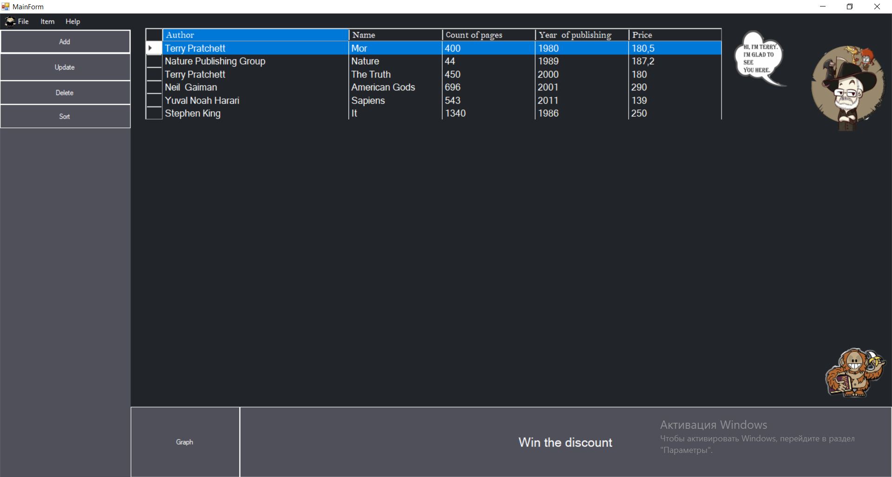
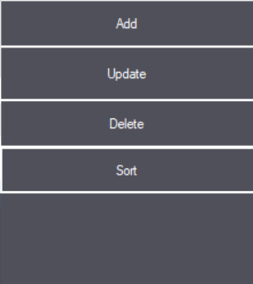
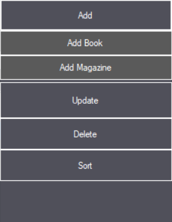
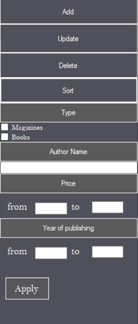
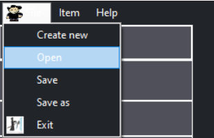
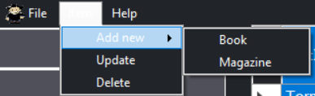
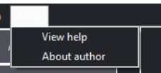
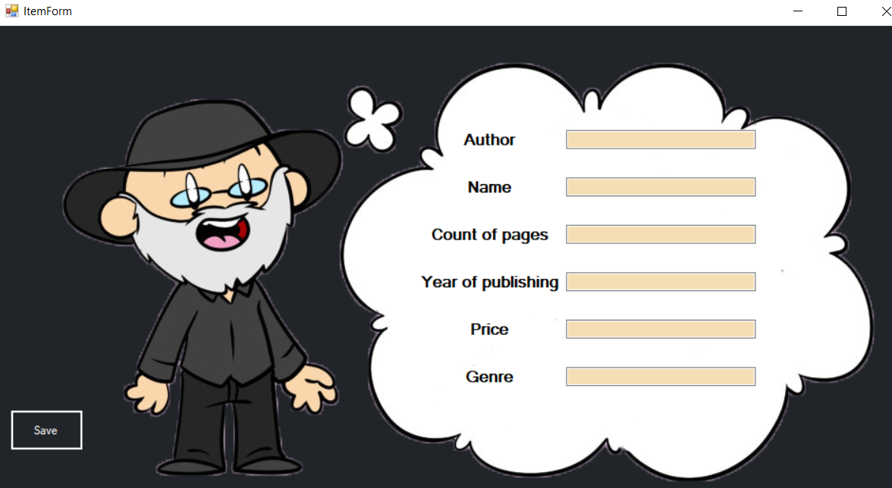
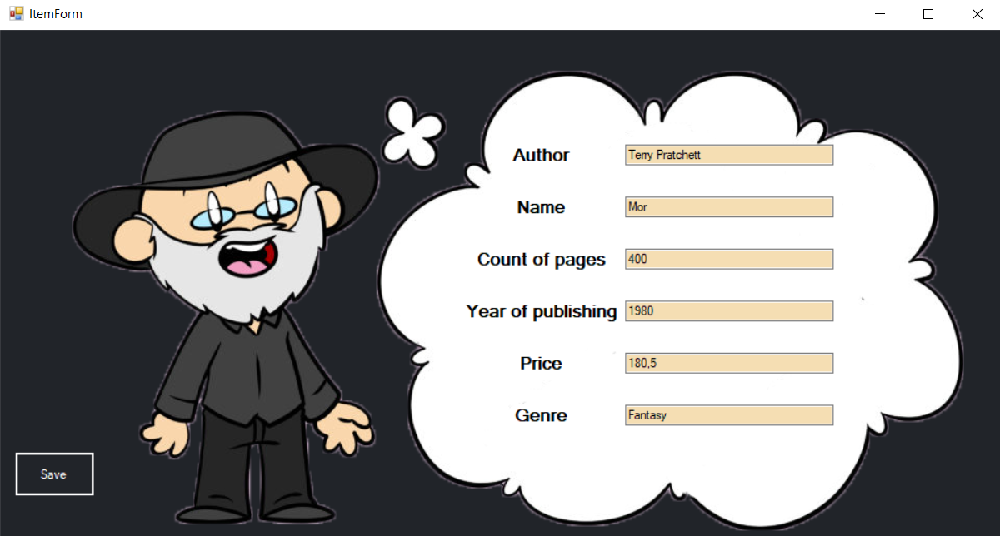

# Edition Catalog
## Description:
Windows Forms application for accounting books, magazines. For its help you can save information about books and magazines. Make sorting or searching by any criterias. Add, update or delete information about editions.
## Load form:

Application loading form.

## Main form:

### Menu panel 

 

#### Add
 

A panel where you can choose what to add. A book or magazine.
#### Update

 

Button with which you can change the data of the selected edition.

#### Delete

 
Button with which you can delete the selected edition.

#### Sort
 
A panel where you can filter the data according to the parameters.

### Menu Strip 
Description in progress...

### Data Grid View 
Description in progress...

## Item form:
### Add Book

Form for adding a new book.
### Add Magazine
Description in progress...
### Update Book 

Form for updating a book.
### Update Magazine
Description in progress...

