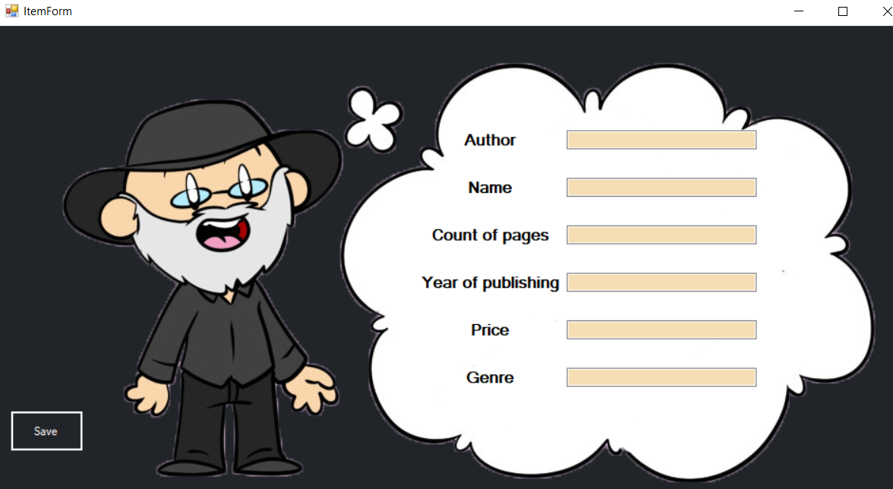
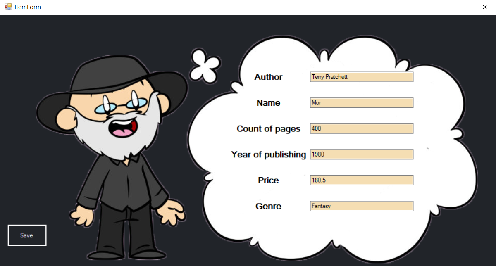

# Edition Catalog
## Description:
Windows Forms application for accounting books, magazines. For its help you can save information about books and magazines. Make sorting or searching by any criterias. Add, update or delete information about editions.
## Load form:

Application loading form.

## Main form:
### Menu Strip 
Description in progress...
### Data Grid View 
Description in progress...

### Menu panel 

#### Add
Description in progress...

#### Update

Description in progress...

#### Delete
Description in progress...

#### Sort
Description in progress...
## Item form:
### Add Book

Description in progress...
### Add Magazine
Description in progress...
### Update Book 

Description in progress...
### Update Magazine
Description in progress...

